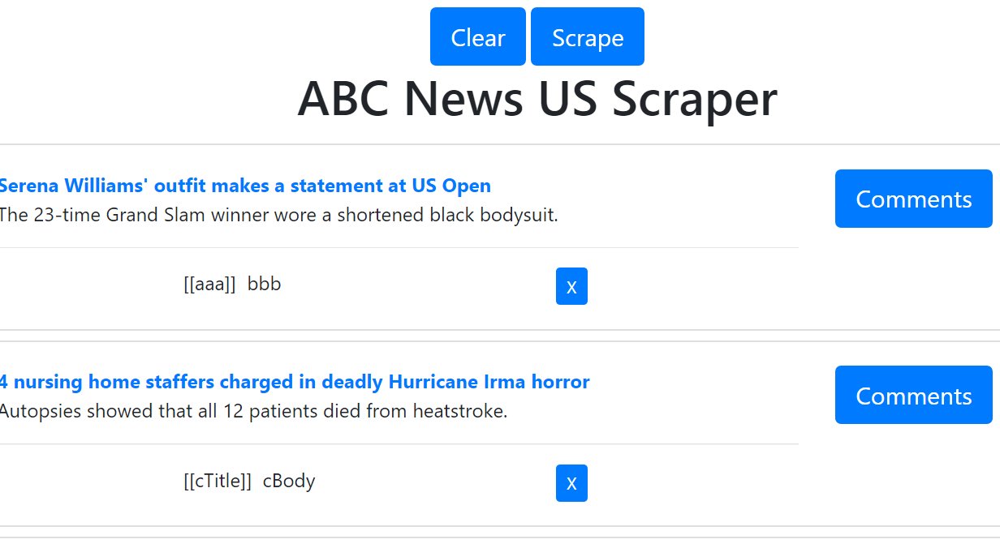
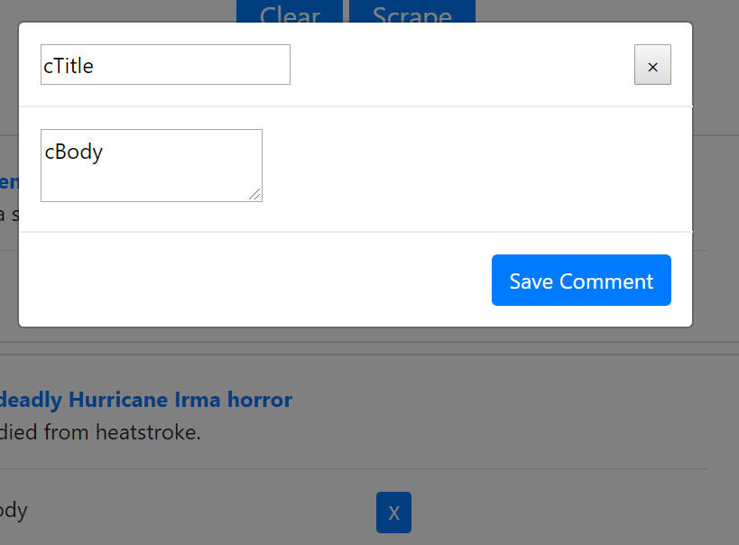

# abc-news-scrape

## heroku live URL
http://yzhou-abcnews-us-scrape-live.herokuapp.com/

## git repo
https://github.com/yzhouyzhou/abc-news-scrape

## Mongoose scrape abc-news-US
This web app uses mongoose scrape skill to scrape ABC news US. lets users view and leave comments on the latest news.  you'll flex your Mongoose and Cheerio muscles to scrape news from another site.

## functions
*   clear
*   scrape
*   comments to add / update comments
*   display and delete comments
*   comments display with comments title and comments body

## Technologies used

| <ul><li>HTML5</li><li>Bootstrap</li><li>JavaScript</li><li>jQuery</li><li>express-handlebars</li></ul>| <ul><li>Node</li><li>Express</li><li>Mongoose</li><li>MongoDb</li><li>cheerio</li><li>axios</li></ul> |

